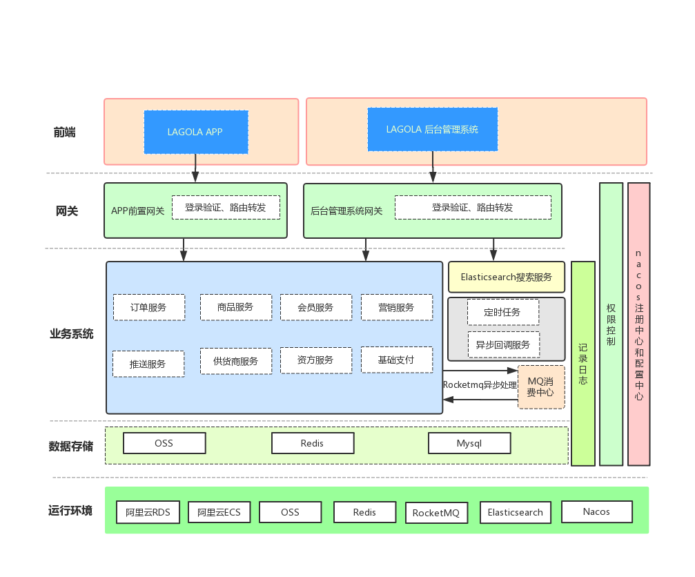

# LAGOLA 商城后端和管理站工程
## 模块划分
- LAGOLA商城网关(lagola-mall-gateway)
- LAGOLA管理站网关(lagola-admin-gateway)
- LAGOLA资金方模块(lagola-fund)
- LAGOLA营销模块(lagola-market)
- LAGOLA商城会员模块(lagola-member)
- LAGOLA MQ消费中心模块(lagola-mq-consumer)
- LAGOLA业务回调处理模块(lagola-notify-center)
- LAGOLA订单模块(lagola-order)
- LAGOLA基础支付模块<主要包含微信支付、支付宝支付、银行卡支付等，不包含资金方支付相关>(lagola-pay-base)
- LAGOLA商品模块(lagola-product)
- LAGOLA搜索引擎(lagola-search)
- LAGOLA消息服务中心<APP PUSH、短信推送、公众号推送等>(lagola-sms-center)
- LAGOLA供应商模块(lagola-supplier)
- LAGOLA定时任务处理(lagola-task)
***
## 系统架构
- 

***
## 开发规范参考

# 项目开发规范

## 开发手册
- [阿里巴巴开发手册](https://github.com/alibaba/p3c/blob/master/%E9%98%BF%E9%87%8C%E5%B7%B4%E5%B7%B4Java%E5%BC%80%E5%8F%91%E6%89%8B%E5%86%8C%EF%BC%88%E5%8D%8E%E5%B1%B1%E7%89%88%EF%BC%89.pdf)
- [代码格式化](https://github.com/alibaba/p3c/tree/master/p3c-formatter)
## Eclipse P3C插件#

环境：JDK1.8，Eclipse4+。有同学遇到过这样的情况，安装插件重启后，发现没有对应的菜单项，从日志上也看不到相关的异常信息，最后把JDK从1.6升级到1.8解决问题。

Help -> Install New Software...

输入Update Site地址：https://p3c.alibaba.com/plugin/eclipse/update 回车，然后勾选Ali-CodeAnalysis，再一直点Next Next...按提示走下去就好。 然后就是提示重启了，安装完毕。

注意：有同学反映插件扫描会触发很多 "JPA Java Change Event Handler (Waiting)" 的任务，这个是Eclipse的一个[bug](https://bugs.eclipse.org/bugs/show_bug.cgi?id=387455)，因为插件在扫描的时候会对文件进行标记，所以触发了JPA的任务。卸载JPA插件，或者尝试升级到最新版的Eclipse。附：[JPA project Change Event Handler问题解决](https://my.oschina.net/cimu/blog/278724)

## 插件使用

目前插件实现了开发手册中的53条规则，大部分基于PMD实现，其中有4条规则基于Eclipse实现，支持4条规则的QuickFix功能。

	* 所有的覆写方法，必须加@Override注解， 
 	* if/for/while/switch/do等保留字与左右括号之间都必须加空格,
 	* long或者Long初始赋值时，必须使用大写的L，不能是小写的l）
 	* Object的equals方法容易抛空指针异常，应使用常量或确定有值的对象来调用equals。
 	
目前不支持代码实时检测，需要手动触发，希望更多的人加入进来一起把咱们的插件做得越来越好，尽量提升研发的使用体验。

   
### 代码扫描
可以通过右键菜单、Toolbar按钮两种方式手动触发代码检测。同时结果面板中可以对部分实现了QuickFix功能的规则进行快速修复。

#### 触发扫描
在当前编辑的文件中点击右键，可以在弹出的菜单中触发对该文件的检测。

在左侧的Project目录树种点击右键，可以触发对整个工程或者选择的某个目录、文件进行检测。 

   
也可以通过Toolbar中的按钮来触发检测，目前Toolbar的按钮触发的检测范围与您IDE当时的焦点有关，如当前编辑的文件或者是Project目录树选中的项，是不是感觉与右键菜单的检测范围类似呢。 

  

   
#### 扫描结果  
简洁的结果面板，按规则等级分类，等级->规则->文件->违规项。同时还提供一个查看规则详情的界面。

清除结果标记更方便，支持上面提到的4条规则QuickFix。

#### 查看所有规则

# IDEA P3C插件
### 通过Jetbrains官方仓库安装
1. 打开 Settings >> Plugins >> Browse repositories...

 
 
2. 在搜索框输入alibaba即可看到Alibaba Java Code Guidelines插件，点击Install进行安装，然后重启IDE生效 `注意：因为插件zip包托管在Jetbrains官方CDN上，所以是从国外的服务器进行下载，可能会出现超时的情况`

   

### 通过下载安装包进行安装
1. 打开[插件](https://plugins.jetbrains.com/plugin/10046-alibaba-java-coding-guidelines)页面

2. Settings >> Plugins >> Install plugin from disk...，选择刚刚下载的zip包安装，然后重启IDE

 

### 注意

最低支持IDEA版本为14.1（buildNumber 141.0，可以在About Intellij IDEA中查看版本信息），使用IDEA14的同学最好升级到14.1.7(<a href="https://www.jetbrains.com/idea/download/previous.html" target="_blank">历史版本传送门</a>)

插件基于JDK1.7打包，所以IDEA启动时使用的JDK版本如果是1.6的话就会报Unsupported major.minor version 51.0异常，建议大家都升级一下。

### [中文乱码解决方法](https://github.com/alibaba/p3c/issues/32#issuecomment-336762512)

1. 修改字体——Appearance&Behavior -> Appearance -> UI Options -> Name 里面设置成中文字体——如微软雅黑（microsoft yahei light）、文泉驿(linux)

	 

2. Switch Language to English and restart.

	 
	   

## 插件使用

目前插件实现了开发手册中的的53条规则，大部分基于PMD实现，其中有4条规则基于IDEA实现，并且基于IDEA <a href="https://www.jetbrains.com/help/idea/code-inspection.html" target="_blank">Inspection</a>实现了实时检测功能。部分规则实现了Quick Fix功能，对于可以提供Quick Fix但没有提供的，我们会尽快实现，也欢迎有兴趣的同学加入进来一起努力。
目前插件检测有两种模式：实时检测、手动触发。

### 实时检测
实时检测功能会在开发过程中对当前文件进行检测，并以高亮的形式提示出来，同时也可以支持Quick Fix，该功能默认开启，可以通过配置关闭。 

#### 结果高亮提示

检测结果高亮提示，并且鼠标放上去会弹出提示信息。

  

  

#### <a href="https://www.jetbrains.com/help/idea/intention-actions.html" target="_blank">Intention</a> QuickFix功能

Alt+Enter键可呼出Intention菜单，不同的规则会提示不同信息的Quick Fix按钮

  

#### 关闭实时检测  
在某些情况下，我们不希望对代码提示违规信息，比如我们在阅读Github开源项目代码的时候，如果界面出现一堆红色、黄色的提示，此时心里肯定是飘过一万只草泥马。这个时候我们可以通过Inspection的设置关闭实时检测功能。
1. 通过右键快速关闭（打开）所有规则的实时检测功能

  
2. 通过Settings >> Editor >> Inspections 进行手动设置  

 

也可以关闭某条规则的实时检测功能或者修改提示级别。
   
### 代码扫描

可以通过右键菜单、Toolbar按钮、快捷键三种方式手动触发代码检测。同时结果面板中可以对部分实现了QuickFix功能的规则进行快速修复。 

#### 触发扫描
在当前编辑的文件中点击右键，可以在弹出的菜单中触发对该文件的检测。

   
   
在左侧的Project目录树种点击右键，可以触发对整个工程或者选择的某个目录、文件进行检测。

   
   
   如果您打开了IDE的Toolbar，也可以通过Toolbar中的按钮来触发检测，目前Toolbar的按钮触发的检测范围与您IDE当时的焦点有关，如当前编辑的文件或者是Project目录树选中的项，是不是感觉与右键菜单的检测范围类似呢。

   
   使用快捷键（Ctrl+Shift+Alt+J）触发弹出窗口，选择检测范围；您也可自定义快捷键。

    
   
   
   
#### 扫描结果  
检测结果直接使用IDEA Run Inspection By Name功能的结果界面，插件的检测结果分级为Blocker、Critical、Major。默认按等级分组，方便统计每个级别错误的数量。

   
默认情况我们在结果面板需要双击具体违规项才能打开对应的源文件，开启Autoscroll To Source选项，单击面板中的文件名、或者是具体的违规项的时候IDEA会自动打开对应的源文件。

   
 
#### QuickFix
对于实现Quick Fix的规则，在结果面板中可以直接一键修复 `注意：IDEA14、15可以通过左下角的灯泡进行一键修复操作。`

   
   
   
   
#### 其他
面板中其他按钮的功能大家自行探索吧，就不一一赘述了

### 代码提交时检测
1. 在提交代码框勾选Alibaba Code Guidelines选项
   
2. 如果有违反手册的地方会提示是否继续提交，选择取消后会自动对修改的代码进行扫描
   